# Red Dead Dimension

A Wild West train shooter where your hand is the gun. Built in 24 hours at SteelHacks 2026, now for two players on two computers: [co-op or a 1v1 duel](#two-players).

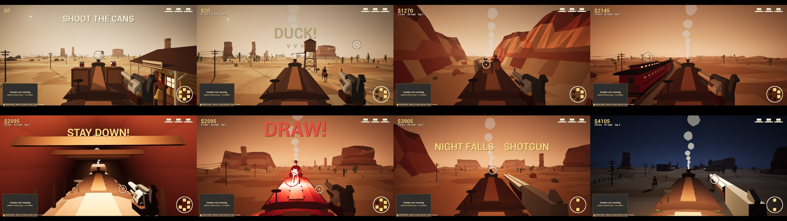

You're on the roof of a moving steam train and bandits keep coming. Make a finger gun at your webcam and point. That's your crosshair. There's no controller.

| You do | Game does |
| --- | --- |
| Point a finger gun | Aim |
| Drop your thumb | Fire |
| Slap the gun hand with your other hand | Reload |
| Lean / duck for real | Dodge bullets, signal arms and tunnels |
| Lower your arm | Holster (for the showdown) |

You have three hats. Riders, boarders, a second train, then a boss duel. Then it all comes round again, faster, and night falls. Lose all three hats and it's over.

## How it works

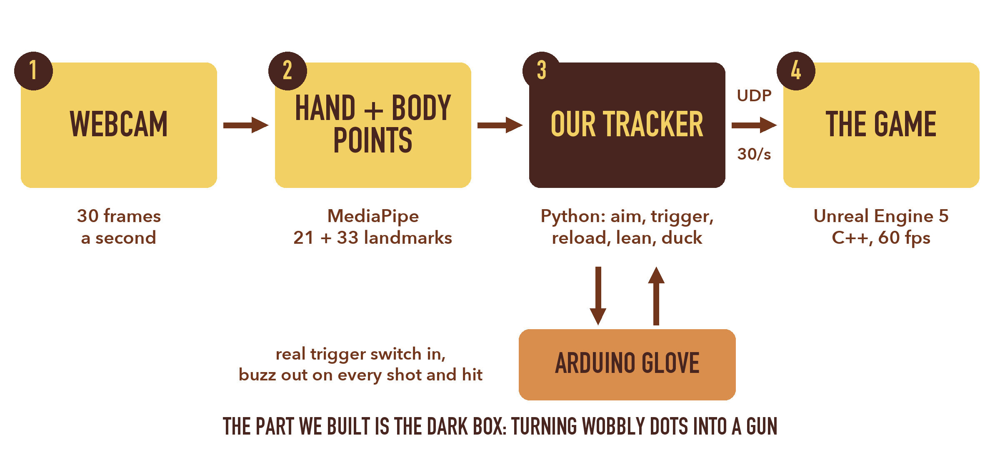

We didn't train a model. MediaPipe gives us hand and body skeletons, and everything after that is our own geometry in `tracker/`:

- **Real-world scale from one RGB camera.** Palm bones don't stretch, so how big they look tells us how far away the hand is. Aim is measured in actual centimetres of fingertip travel, so it feels the same sitting at a laptop or standing across a room.
- **Aim is fingertip position, not finger direction.** We tried casting a ray along the finger. A finger pointed at a camera is basically a dot, so the direction is useless. Position is steady to about 2 mm.

  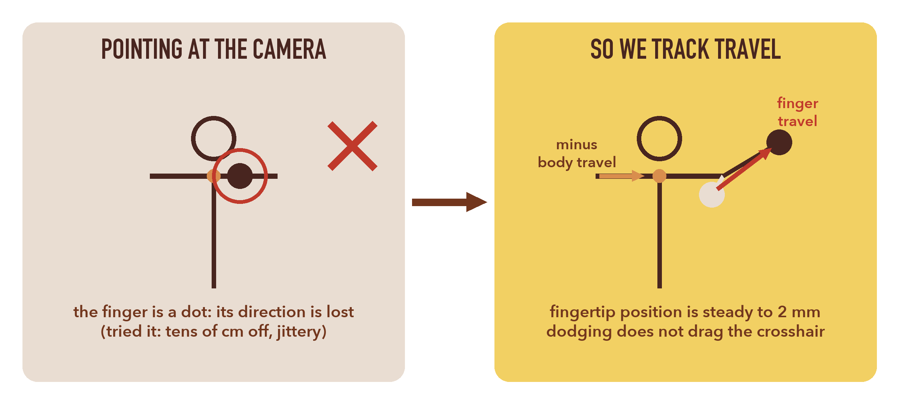

- **Shots rewind.** Pulling the trigger jerks your hand. We keep a second of aim history and fire where you were pointing just before the jerk.

  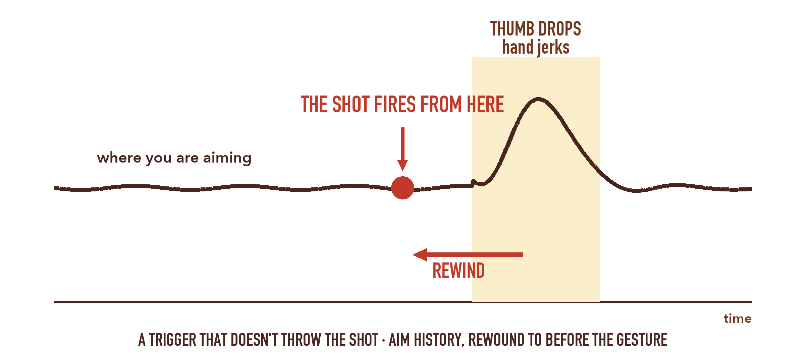

- **One Euro filter** on the aim: heavy smoothing when you hold still, almost none when you move fast.
- **Crowd-proof.** A hand only counts if it's attached to the player's arm and isn't farther away than their chest. Spectators behind you can't steal the aim.

Every threshold in `tracker/config.py` marked `[rec]` came from replaying recorded sessions, not guessing. The pipeline has no camera or network code in it, so recordings replay through it exactly.

The game side is C++ in `unreal/FingerGunGame/Source`. The world streams under a fixed train in chunks, every enemy shot is telegraphed and takes long enough to arrive that you can dodge it, and the crosshair leans onto targets so webcam jitter doesn't cost you hits. More in [docs/ARCHITECTURE.md](docs/ARCHITECTURE.md).

## Screenshots

| | |
| --- | --- |
| 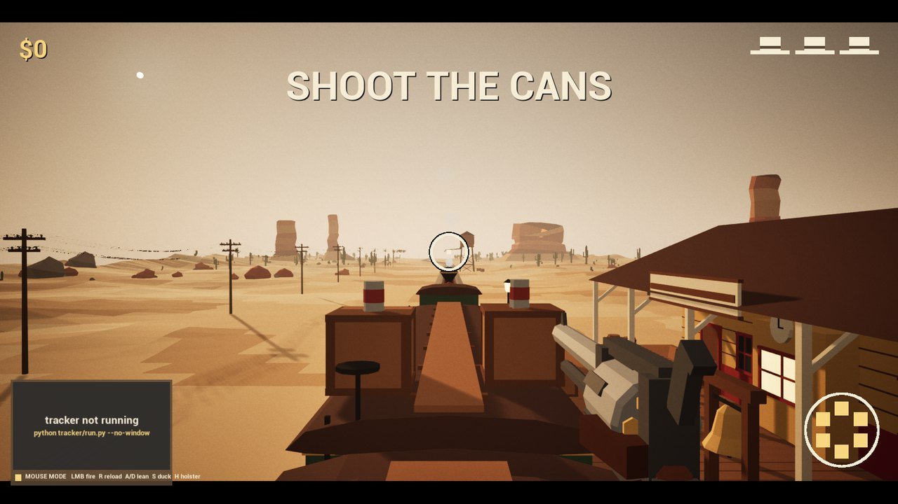 Shooting cans at the station: the tutorial doubles as tracker calibration | 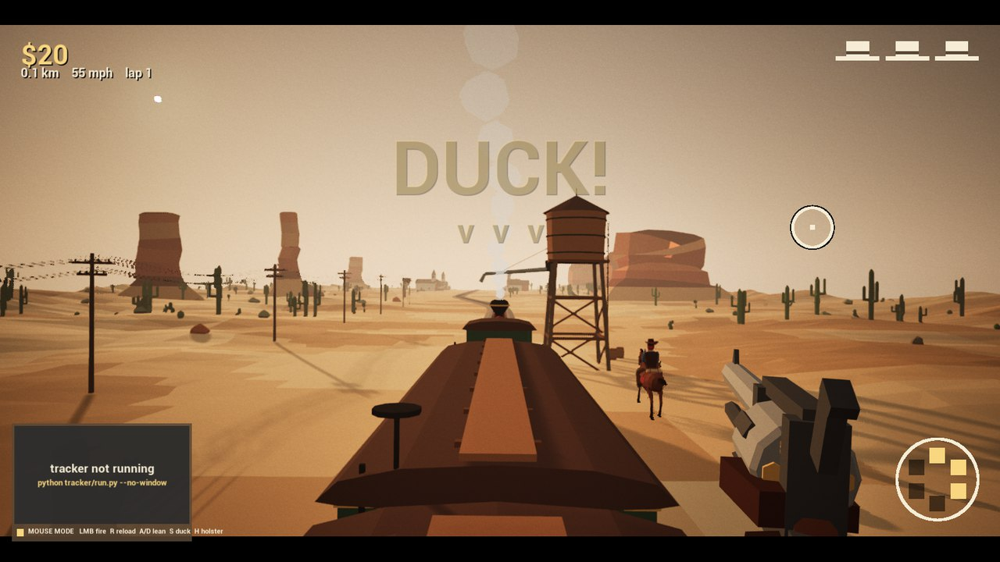 Water tower spout ahead, duck for real |
| 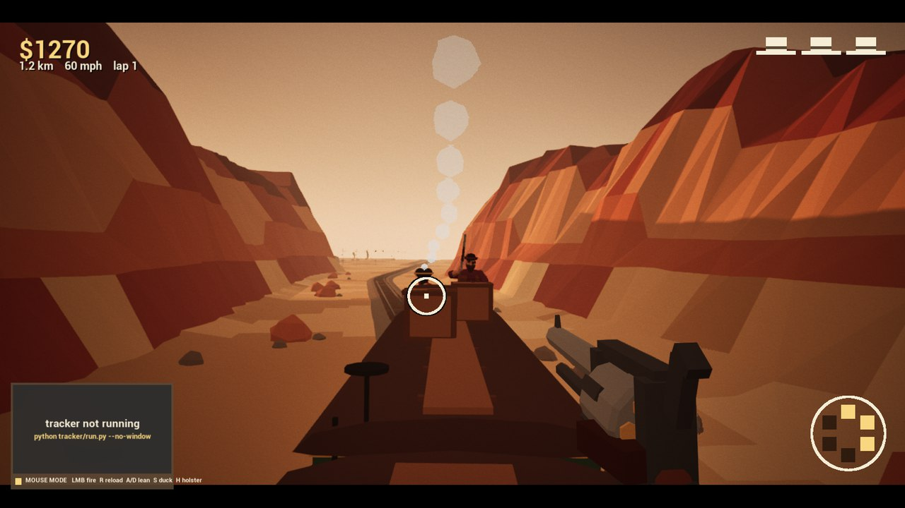 Riders in the canyon | 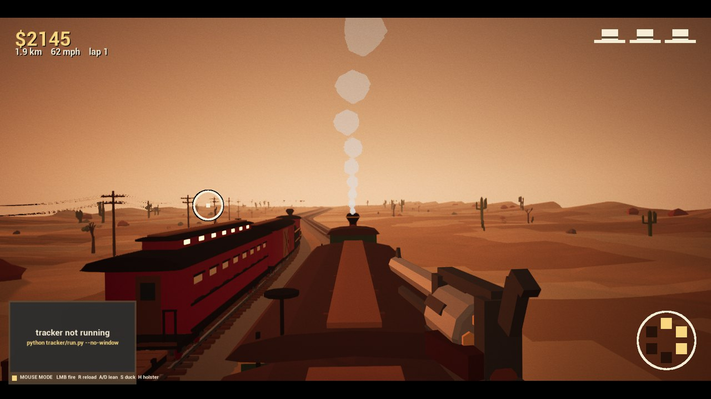 The bandit train pulls alongside |
| 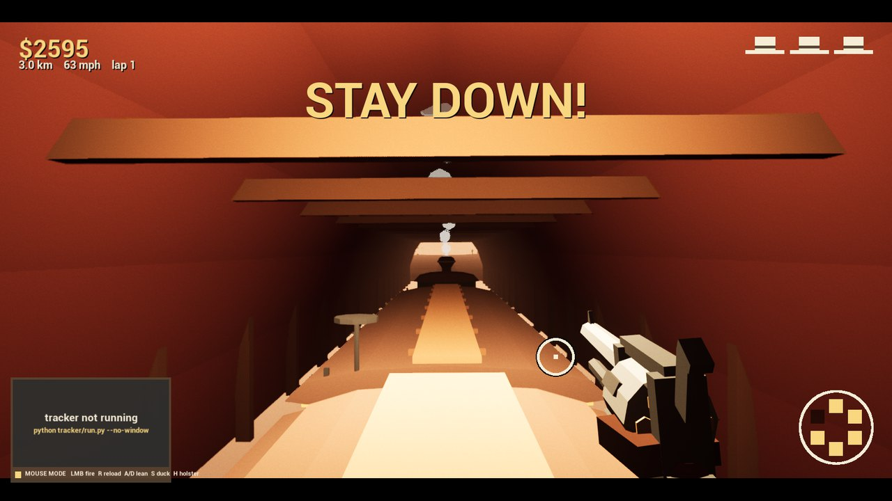 Stay down through the tunnel | 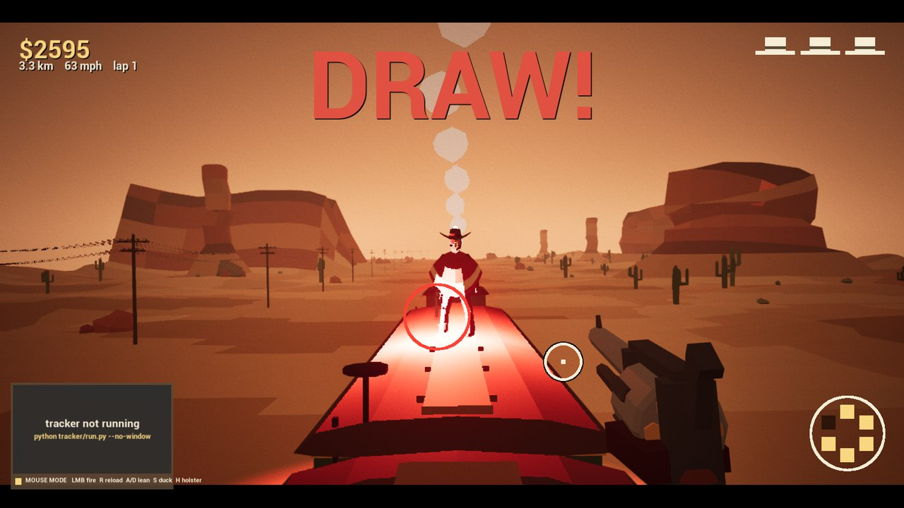 Holster, wait, DRAW |
| 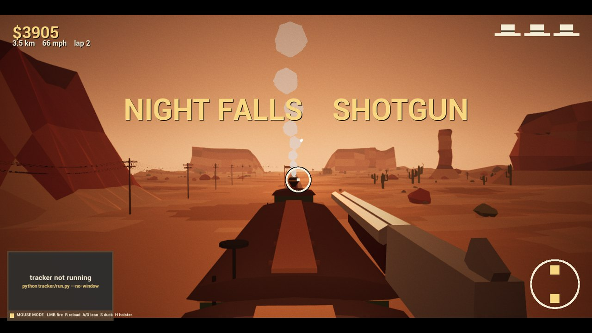 Beat the boss and night falls, with a new gun | 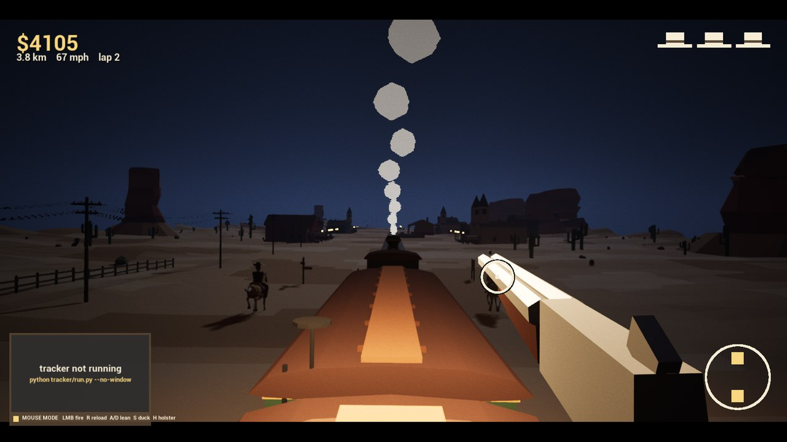 Lap two, in the dark |

## Two players

The game opens on a menu. Aim at an item with your finger gun (or the mouse) and shoot it, or press 1-4:

| | |
| --- | --- |
| **Ride** | On your own: the run above. |
| **Host a co-op ride** | You and a partner on two computers, on the same roof, against the same bandits. |
| **Host a 1v1 duel** | You against your partner, quick-draw. |
| **Join a partner** | Your partner hosts a ride or a duel; type the address their screen shows. |

Each player sits at their own computer with their own webcam. Mouse and keys work too.

### Co-op ride

- Each of you has three hats. Lose them all and you're down: you can't shoot, and the bandits leave you alone.
- Any headshot gives a hat to whoever needs it most. If your partner is down, that brings them back. Beat the boss and everyone is back up.
- A bandit shoots at whichever of you can see it coming and has the fewest guns on them. Its warning ring is red when it's aimed at you, amber when it's aimed at your partner.
- Duck bars, signal arms and tunnels catch each of you where you stand. Your partner kneels on the roof in front of you and ducks and aims when they do.
- At the boss duel, both of you holster. If either of you fires before DRAW, the wait starts over. The boss draws on both of you.
- The ride is over when you're both down. Both shoot the poster to ride again.

### 1v1 duel

- You stand at opposite ends of the passenger car roof, ten metres apart, facing each other, while the train rolls on.
- Each round: both holster (gun hand to your hip, or hold H). WAIT FOR IT... then DRAW!
- The first to hit the other wins the round, and the loser's hat flies off. Lean out of the way and their shot can miss.
- Fire before DRAW and you lose the round.
- Three hats each: lose them all and you've lost the duel. The poster shows the score and each player's fastest draw.
- Draw speed is timed on each player's own screen from the moment DRAW! appears there, so a slower connection doesn't decide who was faster.

### Connecting

1. Both computers run the game (the same build).
2. The host picks **Host a co-op ride** or **Host a 1v1 duel** (or starts with `./play.sh --coop-host` / `./play.sh --duel-host`). The screen shows their address and waits.
3. The other player picks **Join a partner**, types that address and presses Enter (or `./play.sh --coop-join 192.168.1.20`).

On the same Wi-Fi that's all. Over the internet, the host forwards UDP port 7777 on their router to their computer and gives out their public IP, or you both join the same [Tailscale](https://tailscale.com) network and use the host's Tailscale address. The first time, macOS asks the host whether to accept incoming connections: allow it.

Trying it on one Mac: `unreal/FingerGunGame/Scripts/coop_test.sh` (or `--versus`) starts a host and a guest side by side, both playing themselves. How it works is in [docs/ARCHITECTURE.md](docs/ARCHITECTURE.md#10-co-op).

## The glove

Optional. An Arduino with a switch under the thumb, a buzzer and an LED. The click gives an exact trigger time and you feel a buzz when you get hit. Firmware is in `arduino/finger_gun_glove/`. The game plays fine without it.

## Running it

You need Unreal Engine 5.8, Python 3 and a webcam.

```bash
cd tracker
python3 -m venv .venv
.venv/bin/pip install -r requirements.txt
```

The two MediaPipe model files go in `tracker/models/`. The tracker prints the download links if they're missing.

Open `unreal/FingerGunGame/FingerGunGame.uproject` once and let it build. Then, from the repo root:

```bash
./play.sh
```

On Windows:

```powershell
powershell -ExecutionPolicy Bypass -File .\play.ps1
```

This starts the game and the tracker together. The game also works with mouse and keyboard if the tracker isn't running (LMB fire, R reload, A/D lean, S duck, H holster). Space recentres the aim if you or the camera moved.

Useful tracker flags (run from `tracker/`):

```bash
python run.py                          # tuning window with the skeleton overlay
python run.py --record                 # save landmarks to a .jsonl
python run.py --replay recordings/x.jsonl
python run.py --set aim_span_m=0.5     # override any config value
```

Don't upgrade mediapipe past 0.10.21. Newer versions crash or leak memory on macOS.

## All our own

Every model in the game is built by Python scripts in `art/blender/` (characters, horses, the train, the buildings, the canyon chunks) and exported from Blender. Placeholder sounds are generated by `unreal/FingerGunGame/Scripts/make_audio.py`.


## Layout

```
tracker/   Python computer vision + gesture logic
unreal/    UE5 game
arduino/   glove firmware
art/       Blender build scripts and exported models
docs/      architecture notes, slides, screenshots
```
